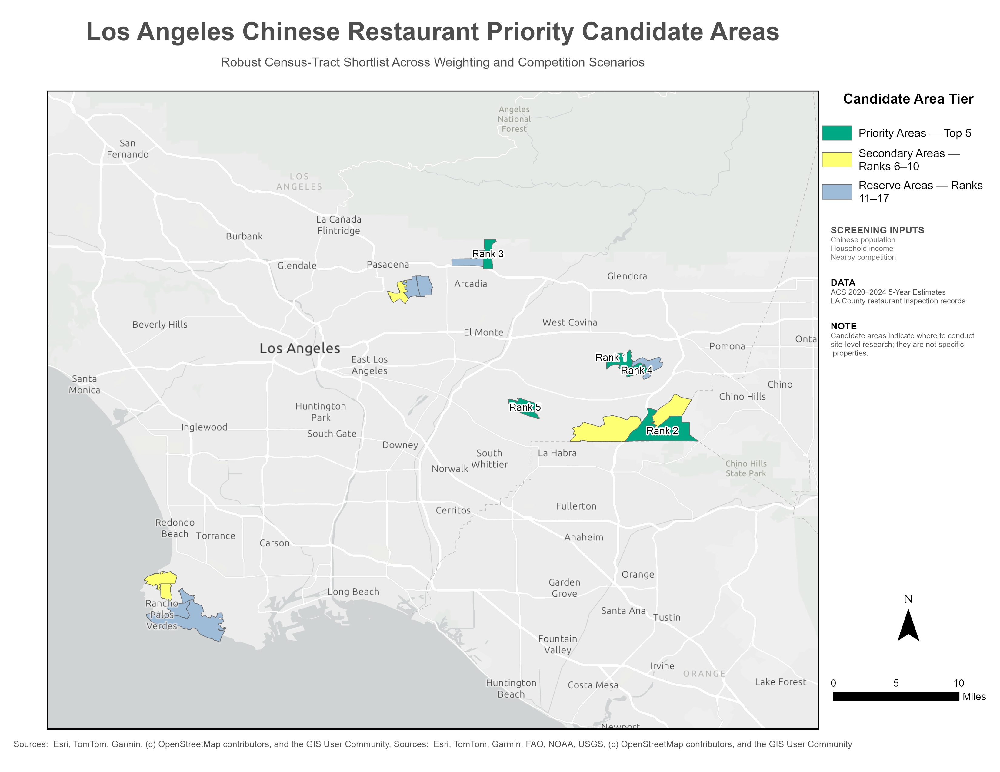

# Los Angeles Chinese Restaurant Market Opportunity and Site Selection Analysis

## Project Overview

This portfolio project evaluates market opportunity for a hypothetical
mid-priced Chinese restaurant in Los Angeles County.

The analysis combines restaurant inspection records, American Community
Survey demographic estimates, Census tract boundaries, geocoded competitor
locations, spatial analysis, and sensitivity testing to identify areas that
should be prioritized for detailed site-level investigation.

The results identify promising Census-tract areas—not specific available
restaurant properties.

## Final Candidate-Area Map

## Key Results

- 101,244 restaurant inspection records reviewed
- 27,438 active restaurant facilities identified
- 559 high-confidence Chinese restaurant candidates
- 510 accepted and geocoded high-confidence competitor locations
- 772 locations included in the expanded competition scenario
- 2,498 Los Angeles County Census tracts analyzed
- 964 tracts eligible for preliminary screening
- 85% retention between baseline and expanded-competition Top 20 rankings
- 17 robust finalist areas
- 5 priority candidate areas recommended for site-level investigation
- Census tract `06037403407` received the strongest consensus ranking

## Business Question

Which areas in Los Angeles County combine:

- Strong potential Chinese-customer demand
- Favorable household income
- Relatively limited nearby Chinese restaurant competition
- Stable performance under alternative scoring assumptions

## Data Sources

- Los Angeles County restaurant inspection records
- U.S. Census Bureau ACS 2020–2024 5-Year Estimates
- U.S. Census Bureau 2024 TIGER/Line Census tract boundaries
- U.S. Census Bureau Batch Geocoder

## Methodology

1. Cleaned and validated restaurant inspection and facility records.
2. Identified Chinese restaurant candidates using facility-name keywords.
3. Geocoded candidate restaurant addresses.
4. Joined restaurant locations to Los Angeles County Census tracts.
5. Calculated competitors within one-mile and three-mile distances.
6. Combined demographic demand, household income, and competition indicators.
7. Created demand-focused, balanced, and competition-focused scoring scenarios.
8. Tested sensitivity to an expanded competitor definition.
9. Selected candidate areas that remained strong across both sensitivity tests.

## Preliminary Scoring Framework

The balanced screening model used:

- 60% demographic demand
- 20% median household income
- 20% inverse competition

The model was used for preliminary market screening rather than prediction of
restaurant profitability.

## Tools

- Python
- pandas
- GeoPandas
- DuckDB and SQL
- ArcGIS Pro
- Jupyter Notebook
- Visual Studio Code

## Limitations

Restaurant cuisine was inferred from facility names, so competitor
classification may include false positives or omit restaurants without
recognizable cuisine keywords.

ACS tract estimates include margins of error, particularly for small
population subgroups.

The model does not include commercial rent, property availability, zoning,
traffic, parking, delivery demand, or parcel-level accessibility.

Candidate areas therefore require field research and site-level validation
before any location decision.

## Next Steps

- Review the five priority candidate areas at the parcel level
- Add commercial rent and property availability data
- Evaluate traffic, parking, transit, and delivery accessibility
- Validate competitors through manual business-directory research
- Conduct field visits and local market assessment# Los Angeles Chinese Restaurant Market Opportunity and Site Selection Analysis

